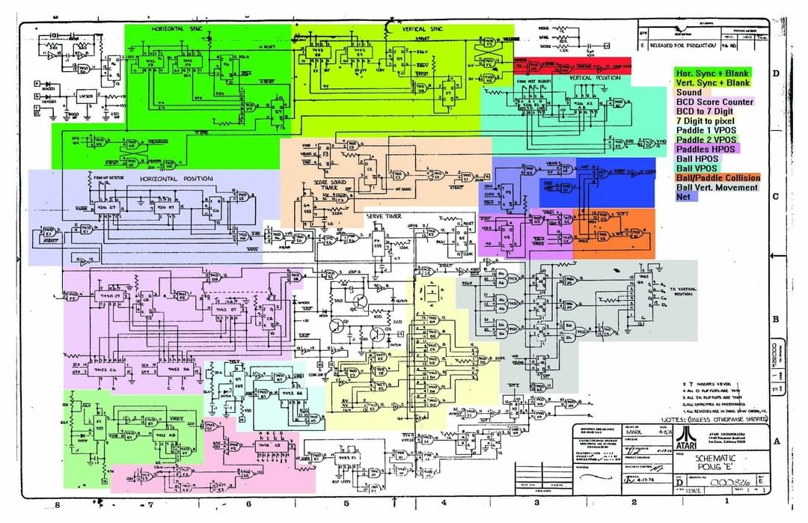

# Pong FPGA realization

This repository tries to implement the original Pong arcade game from scratch on a FPGA Board.

## 1. Requirements

- [ ] 1.1. The game should be playable on a VGA monitor
- [ ] 1.2. The game should be playable with a joystick
- [ ] 2.1. The target hardware is a [Terasic DE10-Lite](https://www.terasic.com.tw/cgi-bin/page/archive.pl?Language=English&CategoryNo=234&No=1021#contents) board
- [ ] 2.2. Add a daughterboard to supply needed resistors, capacitors and bare transistors

Implementation:
- [X] 3.1. Hsync
- [X] 3.2. Vsync
- [ ] 3.3. Pixel Clock
- [ ] 3.4. Pixel Data
- [ ] 3.5. Joystick
- [ ] 3.6. Score
- [ ] 3.7. Ball
- [ ] 3.8. Paddle

## 2. Original Pong Design

The idea for this project came to me after seeing the original hardware design for the Pong arcade game. The original design is a very simple design, which is why I wanted to try to implement it on a FPGA board.

I have included the original schematic for the Pong arcade game in this repository and a split up schematic into different features, so that it is easier to understand what is happening.

[Original Schematic](documents/PongSchematics.pdf)

## 3. Implementation

### 3.1. VGA

The DE10-Lite board has a VGA port, which is why I decided to use it as a base.

### 3.2. Logic Design

#### 3.2.1. Sync Generator

To start the whole thing of, we need to implement the logic needed to generate the sync signals for the VGA port. The sync signals are the horizontal and vertical sync signals, which are used to synchronize the monitor with the VGA signals. The sync signals are generated by a counter, which counts up to a certain value and then resets. The value of the counter is used to determine when the sync signal should be high or low. It's a very simple design, which is why I decided to implement it first.